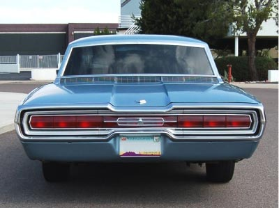
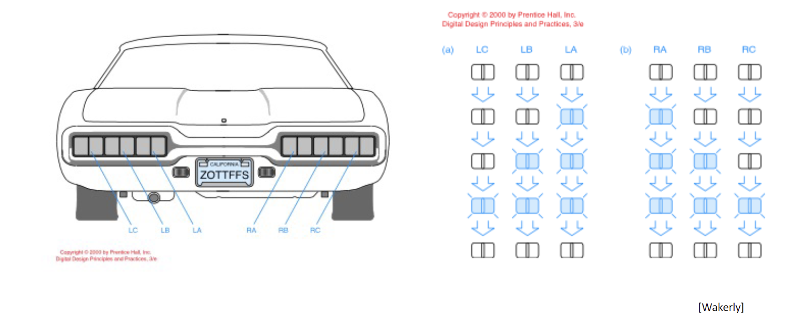
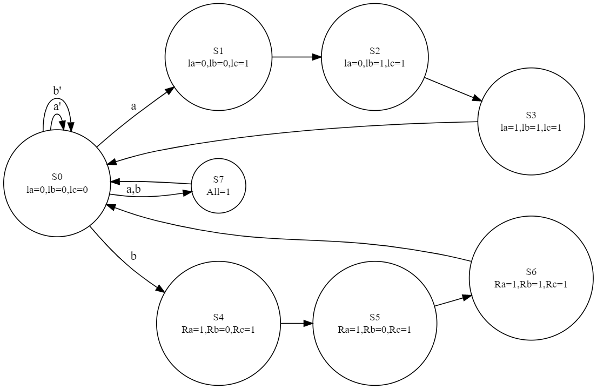

## Thunderbird FSM

The goal of this Lab involved designing the tail lights for a Ford Thunderbird.
The tail lights look like this in real life:


The actual sequence of lights is arranged like this:



### Creating the FSM

Creating the FSM was the easiest part in the project for our team.  We designed it with 8 states, with one being completely off, three for each side to get the sequence right, and one for the hazards.  It should be noted that the hazards are triggered by activating both inputs at the same time, which isn't exactly typical for most cars, it just made potential flaws easier to see.  The custom diagram for this can be shown here, which was made on :


### Markdown

Markdown is a lightweight and easy-to-use syntax for styling your writing. It includes conventions for

```markdown
Syntax highlighted code block

# Header 1
## Header 2
### Header 3

- Bulleted
- List

1. Numbered
2. List

**Bold** and _Italic_ and `Code` text

[Link](url) and 
```

For more details see [Basic writing and formatting syntax](https://docs.github.com/en/github/writing-on-github/getting-started-with-writing-and-formatting-on-github/basic-writing-and-formatting-syntax).

### Jekyll Themes

Your Pages site will use the layout and styles from the Jekyll theme you have selected in your [repository settings](https://github.com/DragonPrime10/Thunderbird-FSM/settings/pages). The name of this theme is saved in the Jekyll `_config.yml` configuration file.

### Support or Contact

Having trouble with Pages? Check out our [documentation](https://docs.github.com/categories/github-pages-basics/) or [contact support](https://support.github.com/contact) and we’ll help you sort it out.
