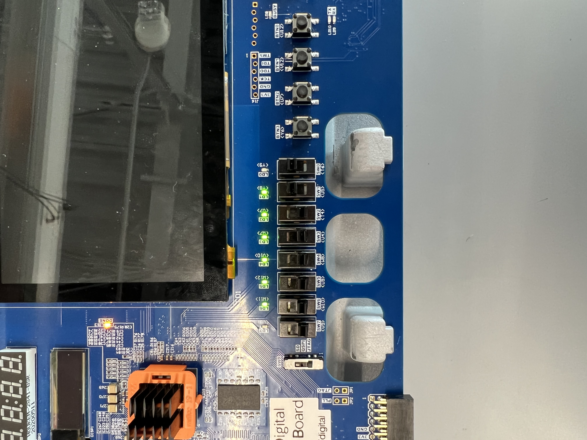

## Thunderbird FSM

The goal of this Lab involved designing the tail lights for a Ford Thunderbird.
The tail lights look like this in real life:


The actual sequence of lights is arranged like this:


### Creating the FSM

Creating the FSM was the easiest part in the project for our team.  We designed it with 8 states, with one being completely off, three for each side to get the sequence right, and one for the hazards.  It should be noted that the hazards are triggered by activating both inputs at the same time, which isn't exactly typical for most cars, it just made potential flaws easier to see.  The custom diagram for this can be shown here, which was made on .


### Transferring to System Verilog

Adding this to System Verilog was arguably easier than it would have been to manually sketch out the circuit and work from there.  All we needed was to know what states did what, k-maps and other such simplification was unnecessary.  We were given a template for a basic FSM, so we altered it to have 8 states and added extra inputs and outputs.  The code looks something like this:

States 0 and 1, along with some instantiation code

```
typedef enum 	logic [3:0] {S0, S1, S2, S3, S4, S5, S6, S7} statetype;
   statetype [3:0] state, nextstate;
   
   // state register
   always_ff @(posedge clk, posedge reset)
     if (reset) state <= S0;
     else       state <= nextstate;
   
   // a = left, b = right
   // next state logic
   always_comb
     case (state)
       S0: begin
	  Lc <= 1'b0;
	  Lb <= 1'b0;
	  La <= 1'b0;
	  Ra <= 1'b0;
	  Rb <= 1'b0;
	  Rc <= 1'b0;
	  if (a==1'b1 && b==1'b0) nextstate <= S1;
	  else if (a==1'b0 && b==1'b1) nextstate <= S4;
	  else if (a==1'b1 && b==1'b1) nextstate <= S7;
	  else   nextstate <= S0;
       end
	   
       S1: begin
	  Lc <= 1'b0;
	  Lb <= 1'b0;
	  La <= 1'b1;
	  Ra <= 1'b0;
	  Rb <= 1'b0;
	  Rc <= 1'b0;	  	  
	  nextstate <= S2;
       end
 ```
 
 After changing the fsm.do and fsm_tb.sv files to check the waveforms and make sure they were right, we implemented it onto a dsdb board.  The hazard lights are shown below, which are only displayed when the left and right switches are triggered at the same time.
 
 
